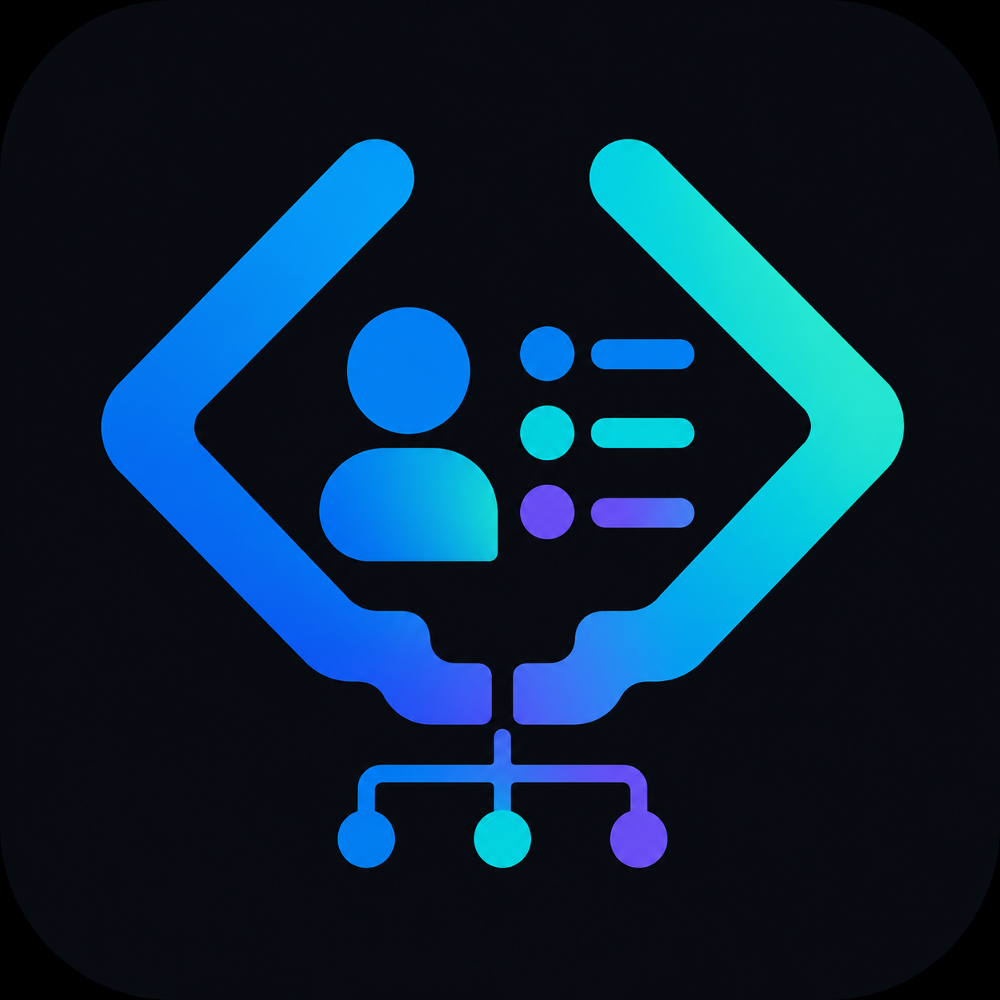

<div align="center">



# vs-crm

**A complete CRM that runs inside VS Code — on top of _your own_ Supabase project.**

Manage clients, leads, projects, tasks, time, invoices (with PDF), expenses, and reports without ever leaving the editor. Your data lives in your Supabase project; the extension never talks to a third-party server.

[](./LICENSE)
[](./package.json)

</div>

---

## Setup walkthrough (video)

[](https://www.youtube.com/watch?v=QR_4xnOcwzI)

## Features

- **Dashboard** — at-a-glance metrics: clients, active projects, unpaid invoices, monthly revenue, recent activity.
- **Clients** — CRUD with tags, search, contact info, communication history.
- **Leads** — Kanban pipeline (New → Contacted → Proposal → Won / Lost) with drag-and-drop.
- **Projects** — Linked to clients, status tracking, budget, dates.
- **Tasks** — List view with priority, status, due dates, and a built-in time tracker that writes to `time_entries`.
- **Invoices** — Line-item editor, tax/discount, status (draft/sent/paid/overdue), branded PDF export via `jsPDF`.
- **Expenses** — Categorized cost tracking, monthly aggregates, project allocation.
- **Reports** — Revenue vs. expenses (last 6 months), top clients, CSV export.
- **Settings** — Profile, currency, default tax rate, brand color (used on PDFs).
- **Auth** — Email/password, magic link, and OAuth (Google, GitHub) all routed back to VS Code via a custom URI handler.
- **Native theming** — Tailwind tokens bound to `--vscode-*` CSS variables. Light, dark, and high-contrast themes inherit automatically.

## Getting started

### 1. Install

Install **vs-crm** from the VS Code Marketplace, or via the command line:

```bash
code --install-extension abdulkadersafi.vs-crm
```

### 2. Create (or open) a Supabase project

You'll need:

- The **Project URL** (`https://xxxxx.supabase.co`)
- The **anon (public) key**
- The **service_role key** (used **once** during onboarding, then discarded)

Find them in your Supabase dashboard under **Settings → API**.

### 3. Run the onboarding

Open the Command Palette and run **`vs-crm: Open`**. The extension walks you through:

1. Pasting your Supabase URL + anon key + service_role key.
2. Pasting a small SQL helper into the Supabase SQL Editor (one-time, the extension drops it for you when bootstrap finishes).
3. Auto-applying the schema migrations (clients, projects, tasks, invoices, etc., all with row-level security).
4. Signing in to your new account.

### 4. Add the redirect URI to Supabase

Before magic-link or OAuth sign-in will work, you must add this exact URI to your Supabase project's **Authentication → URL Configuration → Redirect URLs**:

```
vscode://abdulkadersafi.vs-crm/auth-callback
```

The onboarding screen displays this with a Copy button.

For Google / GitHub OAuth, also configure the provider in **Authentication → Providers** with your own OAuth client IDs.

## Why your own Supabase?

Most CRMs lock you into their database. vs-crm gives you full ownership: you can query the tables directly with `psql`, back them up however you like, run other tools against them, and the extension never proxies your data.

## Public invoice portal (optional)

The Share button on an invoice creates a tokenized link your client can open without signing in. It points at a static page in [`docs/portal/`](./docs/portal) served by GitHub Pages.

To enable it: in your fork's repo settings, **Settings → Pages → Source: Deploy from a branch → `main` / `/docs`**. The portal lives at `https://<you>.github.io/<repo>/portal/`. Update `PORTAL_BASE` in `src/webview/routes/Invoices.svelte` if your URL differs.

The page reads the project URL + anon key + token from the share URL and calls a `SECURITY DEFINER` function (`crm_get_shared_invoice`) that returns only the one tokenized invoice — anon can't enumerate others. Anon keys are designed to be publicly embeddable, so a single deployed portal serves every vs-crm user's share links.

## Invoice email (optional)

Each invoice has an Email button backed by a Supabase Edge Function in [`supabase/functions/send-invoice/`](./supabase/functions/send-invoice). Deploy it + add a Resend API key to enable; see that function's README. Until deployed, the button shows a friendly "not configured" message.

## Recurring invoices (optional)

Mark an invoice as a recurring template in the editor; a daily `pg_cron` job (`crm_run_recurring_invoices`) clones it on schedule. Requires enabling the `pg_cron` extension in **Supabase Dashboard → Database → Extensions** — without it, the migration still applies but templates won't auto-spawn (you can run the function manually).

## Schema

The extension provisions:

- `profiles` — user metadata (currency, tax rate, brand color, etc.)
- `clients`, `leads`, `projects`, `tasks`, `time_entries`
- `invoices`, `invoice_items`, `expenses`
- `communication_logs`, `notifications`
- `_vscrm_migrations` — internal, tracks applied migrations

All user data is row-level security-scoped to `auth.uid() = user_id`.

## Reset

Need to start over (different Supabase project, etc.)? Run **`vs-crm: Reset Onboarding`**. This clears your stored credentials in VS Code's `SecretStorage` but **does not touch the data in your Supabase project** — drop tables manually if you want a clean slate there.

## Development

```bash
git clone https://github.com/Abdulkader-Safi/vscode-extensions-crm.git vs-crm
cd vs-crm
npm install
npm run watch       # esbuild watch + svelte-check watch
# In VS Code, press F5 to launch the Extension Development Host
```

OAuth and magic-link callbacks require the extension to be **installed** (not just running in the dev host). Build a `.vsix` with `vsce package` and `code --install-extension vs-crm-*.vsix` to test those flows end-to-end.

## License

MIT — see [LICENSE](./LICENSE).
